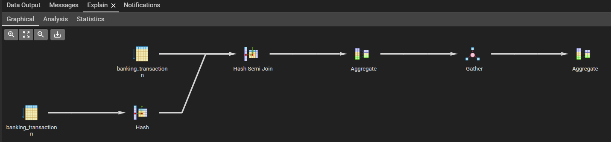

# Tìm các function có thể sử dụng với subquery và tìm hiểu how these functions are executed logically  và giải thích chênh lệch performance. Ex: So sánh EXISTS với IN, which is faster, why?

# TABLE OF CONTENTS
1. [EXISTS](#exists)
2. [IN](#in)
3. [ALL](#all)
4. [ANY](#any)
5. [WITH](#with)
6. [CONCLUSION](#conclusion)

# Dataset Summary
- `Dataset` : Banking_Transactions

- `Number of columns` : 9
- `Number of rows` : 1.048.567

# We will compare EXISTS, IN, ALL, ANY, WITH

# DEFINITION:
- `EXISTS` : Function to check if the sub-query returns true or false. If true, the query runs.

- `IN` : To search in the values of the sub-query to return the satisfied condition.

- `ALL` : To search in the values of the sub-query to return all the satisfied conditions.

- `ANY` : To search in the values of the sub-query to return one of the satisfied conditions.

- `WITH` : Create CTE(Common Table Expression) for a specific purpose.

## `NOTE`:
- All outputs are the same
- `WITH` just for function can use sub-query not for compare

## EXISTS
- Code and Output

    

- Explain Analyze

    
    

## IN
- Code and Output

    

- Explain Analyze

    
    

## ALL
- Code and Output

    

- Explain Analyze

    
    

## ANY
- Code and Output

    

- Explain Analyze

    
    

## WITH
- Code and Output

    

- Explain Analyze

    
    

# Conclusion
## To me, EXIST, IN, ALL, ANY, they use for different purpose. So I think they just can compare in some specific use case, but not really good use case. So this just for researching.
- ### `EXISTS` for checking the condition to run query
- ### `IN` for checking condition in another table or list
- ### `ALL` for satisfied all condition like `AND` operator
- ### `ANY` for satisfied one of all condition like `OR` operator
## But just about my use case, the `EXISTS` is the `fastest`

